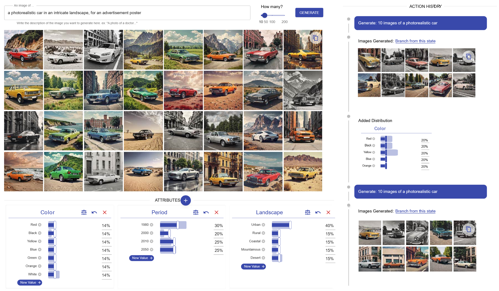

# Varif.ai repository

Varif.ai is an interactive web-based system for user-driven control over diversity in generative image models. 

S1) Generate images from a simple prompt
S2) Verify diversity across attributes like gender, style, or environment
S3) Vary diversity by adjusting attribute distributions and resampling prompts



## Requirements
Requires Python 3+, diffusers, flask, Llama2 weights

Install the environment
```console
pip install -f requirements.txt
```

## Running the server
First, run the local server.<br />

```console
cd frontend
npm install
npm run start
```

Second, run the backend.<br />

```console
cd backend
pyrhon app.py
```

## Cite 

```bibtex
@inproceedings{michelessa2025varfai,
author = {Michelessa, Mario and Ng, Jamie and Hurter, Christophe and Lim, Brian Y.},
title = {Varif.ai to Vary and Verify User-Driven Diversity in Scalable Image Generation},
year = {2025},
doi = {10.1145/3715336.3735847},
booktitle = {Proceedings of the 2025 ACM Designing Interactive Systems Conference},
pages = {1867–1885},
series = {DIS '25}
}
```
